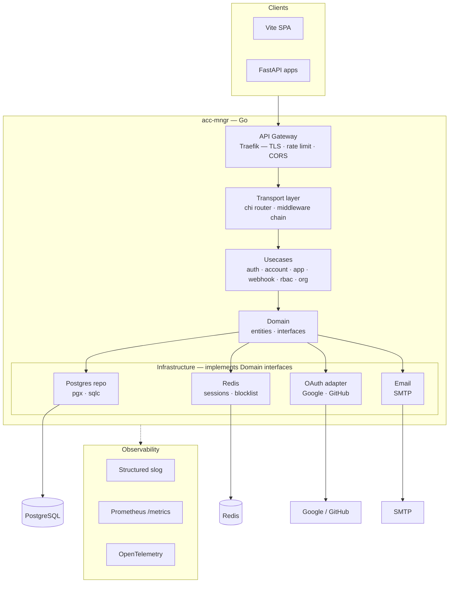

# acc-mngr

**Centralized multi-tenant authentication service built with Go.**  
A simpler, professional alternative to Clerk or Auth0, designed for SaaS applications (React + FastAPI) with single sign‑on, RBAC, and organizations.

---

## 📖 Table of Contents

- [Overview](#overview)
- [Features](#features)
- [Architecture](#architecture)
- [Roadmap](#roadmap)
- [Tech Stack](#tech-stack)
- [Documentation](#documentation)

---

## 🚀 Overview

`acc-mngr` is a standalone authentication service that provides:

- User registration, login, and email verification  
- JWT issuance, validation, and revocation (blocklist)  
- OAuth2 integration (Google, GitHub)  
- Multi‑tenancy – isolated user bases per application  
- Role‑Based Access Control (RBAC) – assign roles to users within an app  
- Organizations / Teams – group users and manage permissions collectively  
- Webhooks for event‑driven integrations  
- Ready‑to‑use admin dashboard (Vite + React)

---

## ✨ Features

| Category                 | Implementation Details                                                                 |
|--------------------------|----------------------------------------------------------------------------------------|
| **Email/Password Auth**  | Secure password hashing (Argon2), email verification via SMTP                           |
| **Social Login**         | OAuth2 providers: Google, GitHub (extensible)                                           |
| **JWT Management**       | Short‑lived access tokens, refresh tokens, Redis‑backed blocklist for instant revocation |
| **Multi‑tenancy**        | Applications (`app`) own their users and settings; tenant isolation at database level   |
| **Sessions**             | Centralized session store in Redis (optional, scalable)                                 |
| **RBAC**                 | Define roles and permissions per application                                            |
| **Organizations**        | Group users into teams/orgs with shared membership                                      |
| **Webhooks**             | Outgoing HTTP calls on user events (signup, login, role change)                         |
| **Observability**        | Structured logging (`slog`), Prometheus metrics, OpenTelemetry tracing                  |
| **Admin UI**             | React SPA to manage applications, users, roles, and organizations                       |

---

## 🏗 Architecture

The project strictly follows **Clean Architecture / Hexagonal** principles, ensuring testability, maintainability, and independence from frameworks.

**Key architectural decisions:**
- **Domain layer** defines business entities (`User`, `App`, `Role`, `Organization`) and repository interfaces.
- **Use cases** orchestrate the flow (e.g., `RegisterUser`, `LoginWithOAuth`, `AssignRole`).
- **Infrastructure** adapters implement interfaces using PostgreSQL (`sqlc`), Redis, SMTP, and OAuth2 clients.
- **Transport** exposes REST API via `chi` with middleware for logging, auth, and rate limiting.

## 🛠 Tech Stack

| Layer          | Technology                                                               |
|----------------|--------------------------------------------------------------------------|
| **Backend**    | Go 1.21+, [chi](https://github.com/go-chi/chi) router, [sqlc](https://sqlc.dev/), [pgx](https://github.com/jackc/pgx) |
| **Database**   | PostgreSQL                                                               |
| **Cache**      | Redis (sessions, blocklist, rate limiting)                               |
| **Auth**       | JWT (access + refresh tokens), OAuth2 (Google, GitHub)                    |
| **Email**      | SMTP (e.g., SendGrid, Mailgun)                                           |
| **Gateway**    | Traefik (TLS termination, CORS, rate limiting)                           |
| **Frontend**   | Vite + React + TypeScript                                                |
| **Observability** | `slog`, Prometheus, OpenTelemetry                                      |
| **Container**  | Docker, Docker Compose                                                   |

---

## 📚 Documentation

- **[Roadmap / Checklist](./docs/roadmap.md)** – granular tasks for implementation.

