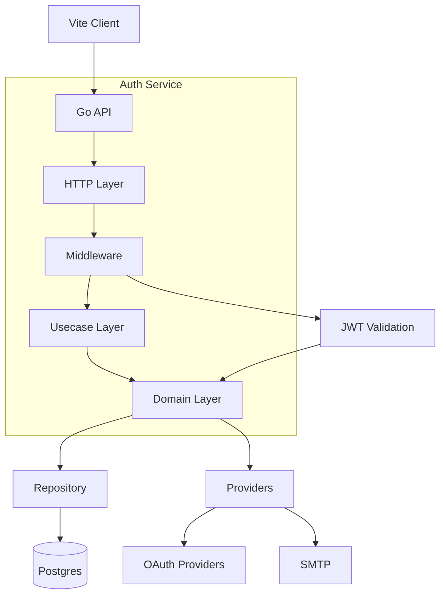

```mermaid
flowchart TD

Client[Vite Client] --> API[Go API]

subgraph Server [Auth Service]
    API --> HTTP[HTTP Layer]
    HTTP --> Middleware[Middleware]
    Middleware --> Usecase[Usecase Layer]
    Usecase --> Domain[Domain Layer]
end

Domain --> Repo[Repository]
Domain --> Provider[Providers]

Repo --> DB[(Postgres)]
Provider --> OAuth[OAuth Providers]
Provider --> Email[SMTP]

Middleware --> JWT[JWT Validation]
JWT --> Domain
```
